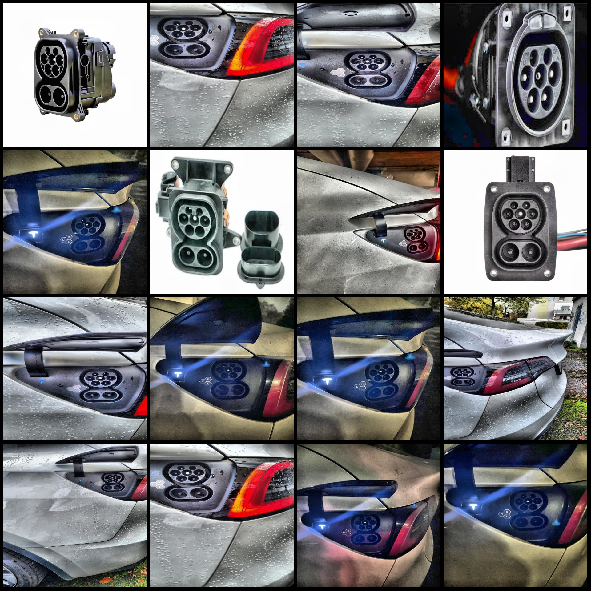
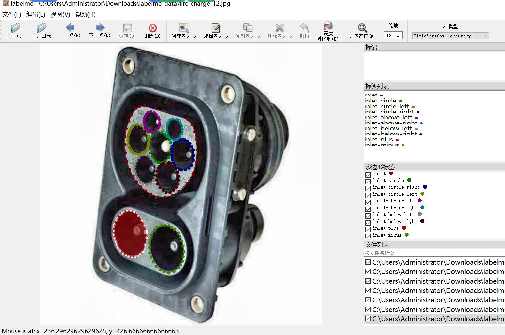

# Electric Vehicle Charging Interface Recognition Data Set with 363 Labeled Images in 10 Categories

The dataset format is labelme format (without mask files, only containing jpg images and corresponding json files).

**number of images: ** 363  
**annotation count: ** 363  
Number of annotations: 10
"inlet"

The number of frames labeled for each category is as follows:
- inlet (entry) count = 363
- inlet-circle (circular entry) count = 363
- inlet-circle-left (left circular entry) count = 363
- inlet-circle-right (right circular entry) count = 363
- inlet-above-left (top left entry) count = 360
- inlet-above-right (top right entry) count = 364
- inlet-below-left (bottom left entry) count = 362
- inlet-below-right (bottom right entry) count = 361
- inlet-plus (positive entry) count = 353
- inlet-minus (negative entry) count = 350

**Total Frames:** 3602

The tool used for annotation is labelme=5.5.0.

**Repository:** firc-dataset

Resolution: 640x640

**Is there any enhancement in the dataset?** Yes, approximately 157 images are original images, and the rest are enhanced images.

Annotation rules: Draw a polygon box around the class.

**Important notes: ** You can open and edit the dataset using LabelMe. JSONDataset needs to be converted into either mask or yolo format or coco format for semantic segmentation or instance segmentation.

**Special Disclaimer:** This dataset does not guarantee the accuracy of the trained models or weight files.

<image>

## Images

Here is a pay link on Stripe ( https://buy.stripe.com/3cs8yP7sY87d0vu9AB ). Please contact me lonlonago@foxmail.com after funding $89, and I will send you a complete data files , thank you!

